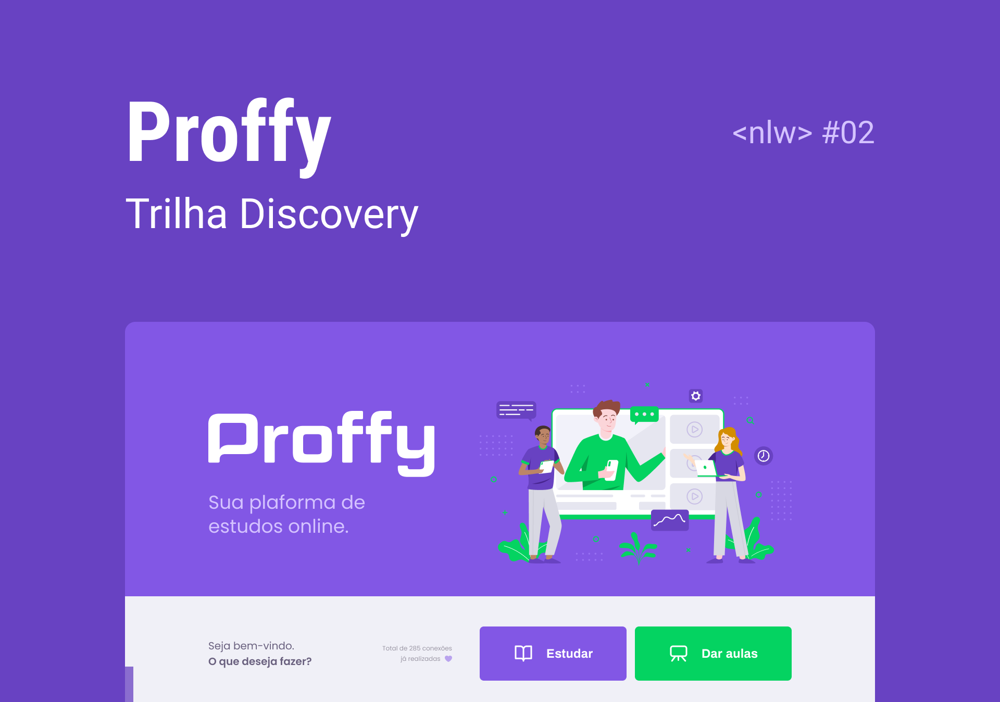

<div align="center">

  

</div>

<div align="center">

[](https://twitter.com/avlyev)
[](https://www.linkedin.com/in/avlye/)
[](https://github.com/Avlye/nlw2-proffy/stargazers)
[](./LICENSE)
[](https://travis-ci.org/Avlye/nlw2-proffy)

</div>

<div align="center">

```ts
console.log("🚀 Project Made in Next Level Week. Build with ❤️")
```

</div>


👽 Table of Contents
=================

<!--ts-->

- [1. What's Is Proffy?](#1-whats-is-proffy)

- [2. Design](#-2-design)
  - [2.1 Download Layouts for Figma](#-21-download-layouts-for-figma)
  - [2.2 Preview](#22-preview)

- [3. Our Stack](#-3-our-stack)
- [4. How To Use](#4-how-to-use)
- [5. 📕 License](#-license)
<!--te-->

## 1. What's Is Proffy?

📖 Proffy is a plataform for connection teachers and students around the world.

**You deserve the best of education, connect with the best teachers in each subject.**

*Proffy* is a cute way of saying "hey teacher" in fundamental schools in Brazil.


## 🎨 2. Design

<div align="center">



**Design created by:**

[](https://www.instagram.com/tiagoluchtenberg/)

Tiago is a methodical guy and passionate about design.

Also he uses some kind of hack in his life, but don't tell everyone.

</div>


### 💿 2.1 Download Layouts for Figma

<div align="center">

[]()
[]()

</div>


### 2.2 Preview

#### Web


### Mobile


## 💻 3. Our Stack

We choose our stack based on the best spaceship 🚀 technologies available.

- TypeScript
- React Native
- Expo
- Express
- SCSS

### Why TypeScript?

TypeScript is a great superset for JavaScript, helps us to be more productivity and type safe when development our apps.

### Why React Native?

We use React as our main front-end library for development interfaces,
React Native helps us to transfer our skills across devices, development cross-platform (IOS & Android) apps.

### Why Expo?

Expo it's almost a React Native superset, helps us to build React Natives quickly, without wasting time in configuring every Native API across devices.

### Why Express?

Express it's a Fast, unopinionated, minimalist web framework for Node.js.
It's has a great community support and fills perfect for build REST APIs.

### OK now but WHY SCSS instead of CSS?

Both solutions are great, SCSS helps us to build more productivity and component based stylesheets for your apps without needing to use alternatives like Styled-Components.

## 4. How To Use

As any rocketship 🚀, it's important to us that you can use this project.

First clone this repo:

```zsh
$ git clone https://github.com/Avlye/nlw2-proffy.git
```

Now each folder has a subproject, that you can follow the instructions bellow for knowing how to use. Trust me, you don't need to be a alien 👽 (that's optional, okay?).

### Configure Dependencies

<div align="center">


</div>

We provide some guides here than can help you:

- [`Preparando o Ambiente` by @RocketSeat](https://www.notion.so/Configurando-Ambiente-NLW-98a471ad3cb6448284b8ceed31c45767)
- [`O Guia DEFINITIVO de UBUNTU para Devs Iniciantes` by Fabio Akita](https://www.youtube.com/watch?v=epiyExCyb2s)
- [`Editor de Código sensacional para Programador Frontend, Backend ou Full Stack` by Filipe Deschamps](https://www.youtube.com/watch?v=Q7YfzbJRzm0)

### Web Project

#### Requirements

- Node.js
- Yarn

### Speed up thrusters

```zsh

# Go to the web folder
# cd means change directory
# cd <path>
$ cd nlw2-proffy/web

# Install Dependencies (with YARN)
$ yarn install

# Run the Web App
$ yarn start
```

Don't be shy, go to [http://localhost:3000](http://localhost:3000) to see the result.

## Server Project

### Requirements

- Node.js
- Yarn
- SQlite3

Psiu: This maybe can help you install SQLite. 😉

```zsh
# Installing SQLite3 on Ubuntu
sudo apt install sqlite3 libsqlite3-dev -y
```

### Speed up thrusters: Turbo 2

```zsh
# Go to the server project
$ cd nlw2-proffy/server

# Install Dependencies (with Yarn)
$ yarn install

# Make Migrations
$ yarn knex:migrate

# Run Server
$ yarn start
```

Server would be running at [http://localhost:3333](http://localhost:3333) by default.

## 📕 License

All files included here including this *README* are under [MIT LICENSE](./LICENSE).

Created by [Gabriel (Avlye) Almir](https://github.com/Avlye). Yo, it's me! 😊
